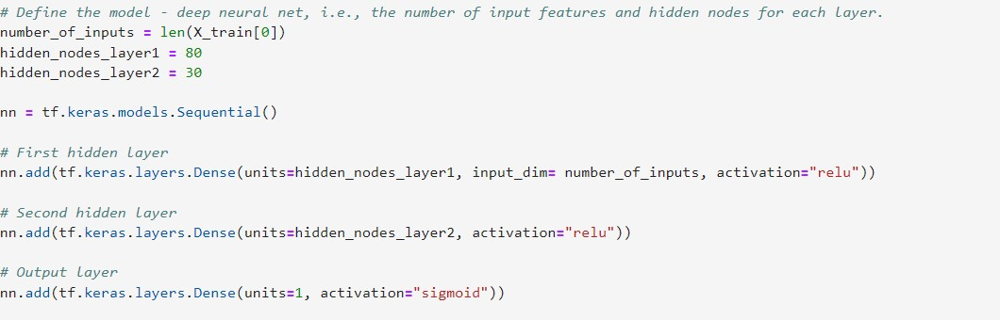
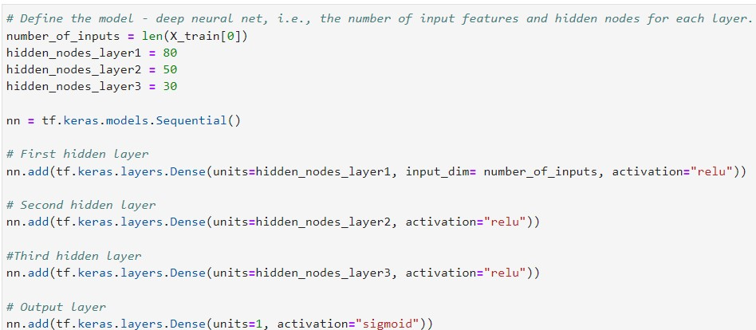
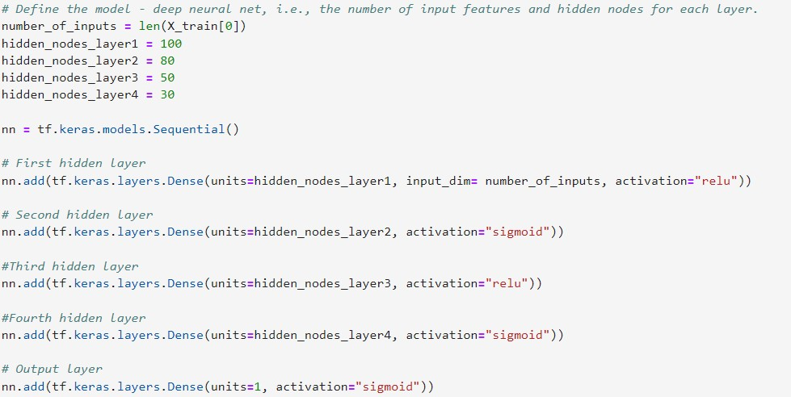

# Implementing Neural Networks models to create a binary classifier 

## Overview

AlphabetSoup is a nonprofit foundation dedicated to helping organizations to protect the environment, improve people's well-being, and unify the world. 
AlphabetSoup has raised and donated money used to invest in lifesaving technologies and organize reforestation groups around the world.  
We will implement Neural Networks to predict which organizations are worth donating to and which are too high risk. 

The Neural Network will be implemented using TensorFlow, the data will be cleaned and preprocessed and the parameters such as hidden layers and neurons will be modified in order to obtain the desired accuracy.

The columns in the dataset are:

* EIN and NAME—Identification columns
* APPLICATION_TYPE—Alphabet Soup application type
* AFFILIATION—Affiliated sector of industry
* CLASSIFICATION—Government organization classification
* USE_CASE—Use case for funding
* ORGANIZATION—Organization type
* STATUS—Active status
* INCOME_AMT—Income classification
* SPECIAL_CONSIDERATIONS—Special consideration for application
* ASK_AMT—Funding amount requested
* IS_SUCCESSFUL—Was the money used effectively

## Results

### Data Preprocessing

* What variable(s) are considered the target(s) for your model? 

The ['IS_SUCCESSFUL'] is considered the target variable. This variable indicates if the donated money has been used effectively, which indicates if it's worth donating to a certain organization.

* What variable(s) are considered to be the features for your model? 

Variables such as ['STATUS'], ['ASK_AMT'], ['APPLICATION_TYPE'], ['INCOME_AMT'], ['STATUS'], ['SPECIAL_CONSIDERATIONS'] among others.

* What variable(s) are neither targets nor features, and should be removed from the input data? 

Variables like ['EIN'] and ['NAME'] were dropped to carry out the analysis because it was considered they don't have much relevance to the model.

### Compiling, Training, and Evaluating the Model

* How many neurons, layers, and activation functions did you select for your neural network model, and why?

##### __First model__
- number of hiddenlayers = 2
- number of neurons in hidden layer 1 = 80 & activation function = relu
- number of neurons in hidden layer 2 = 30 & activation function = relu
- output layer neurons = 1 & activation function = sigmoid
- __accuracy obtained__ = 0.732

#### __Second model__
- number of hiddenlayers = 3
- number of neurons in hidden layer 1 = 80 & activation function = relu
- number of neurons in hidden layer 2 = 50 & activation function = relu
- number of neurons in hidden layer 2 = 30 & activation function = relu
- output layer neurons = 1 & activation function = sigmoid
- __accuracy obtained__ = 0.731

#### __Third model__
- number of hiddenlayers = 4
- number of neurons in hidden layer 1 = 100 & activation function = relu
- number of neurons in hidden layer 2 = 80 & activation function = sigmoid
- number of neurons in hidden layer 3 = 50 & activation function = relu
- number of neurons in hidden layer 4 = 30 & activation function = sigmoid
- output layer neurons = 1 & activation function = sigmoid
- __accuracy obtained__ = 0.722

* Were you able to achieve the target model performance? 

No, the accuracy desired was 75% and the best performance obtained in our model was 73%

* What steps did you take to try and increase model performance? 

Columns like ['STATUS'] and ['SPECIAL_CONSIDERATIONS'] were dropped.  
For every model the epochs were stablished at 100, hidden layers were added, the number of neurons was added and the activation function was changed depending on the hidden layer.

## Summary
The models were not able to achieve the desired accuracy. The best outcome was 73.2% from our second model. 
We could think of using a Machine Learning algorithm such as Support Vector Machine or Random Forest Classifier because these Machine Learning models can easily handle outliers.

